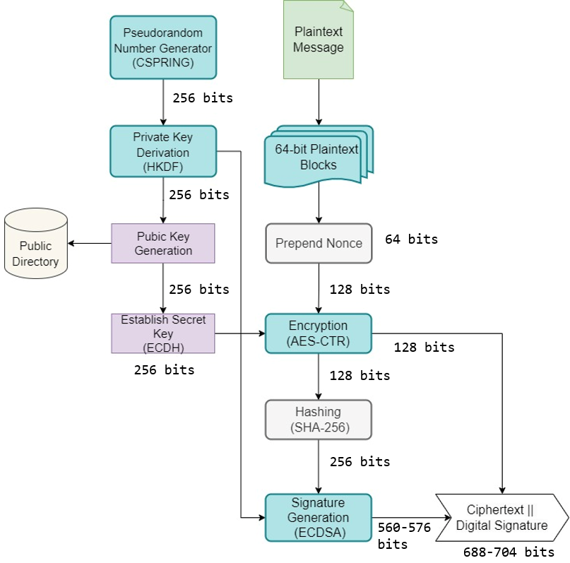
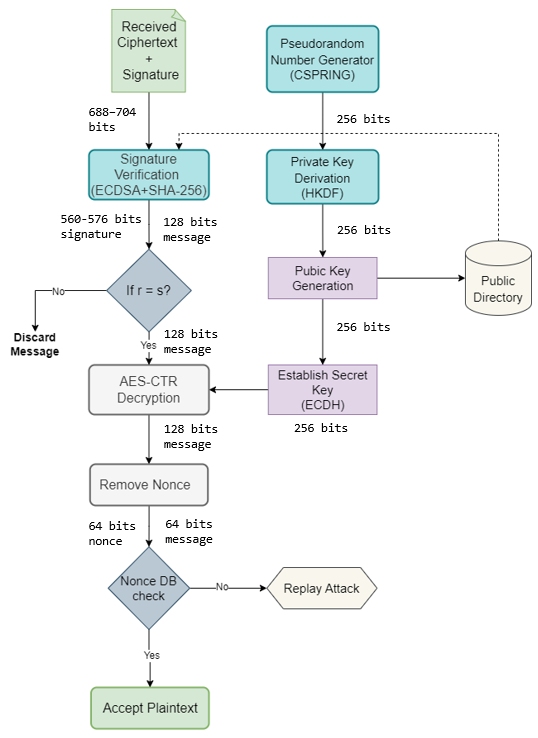

# **JIGS: A Modular Parallel Encryption and Authentication Pipeline for Secure Messaging**

<div align="center">
  <table>
    <tr>
      <td width="50%">
        <p align="center"><strong>Encryption Workflow</strong></p>
        
      </td>
      <td width="50%">
        <p align="center"><strong>Decryption Workflow</strong></p>
        
      </td>
    </tr>
  </table>
</div>

## **Overview**  
JIGS (jigsaw) is a **hybrid secure messaging architecture** designed to balance **security and efficiency**. It integrates:  
- **ECDH key exchanges** for forward secrecy  
- **Nonce-based AES-128 encryption** for data confidentiality  
- **Parallel processing** to enhance speed and performance  

### **Performance Highlights**  
Through experimental results, we observed a **96.67% performance improvement**, demonstrating that parallel encryption significantly enhances processing speed while maintaining security.  

**Key Findings:**  
- **Non-parallelized version:**  
  - Sender: **51.21s processing time**, **5.51 KB/s throughput**  
  - Receiver: **641.39s processing time**, **0.74 KB/s throughput**  
- **Parallelized version:**  
  - Sender: **3.22s processing time**, **59.38 KB/s throughput**  
  - Receiver: **16.08s processing time**, **12.00 KB/s throughput**  
  
The results show that parallel processing drastically improves performance, especially for sending operations. However, due to a higher payload, the receiver remains slower than the sender.  

---

## **Features**  
- **Strong Security:** Uses modern cryptographic standards (ECDH, AES-128)
- **Forward Secrecy:** Ensures past communications remain secure even if keys are compromised
- **Parallel Processing:** Optimized for speed with a modular design
- **Scalable Architecture:** Easily adaptable for different performance requirements
- **Cross-Platform Support:** Works across multiple operating systems via Docker

---

## **Installation & Usage**  
### **1. Clone the Repository**  
```sh
git clone https://github.com/your-username/jigs.git
cd jigs
```

### **2. Install Dependencies**  
```sh
pip install -r requirements.txt
```

### **3. Run the Program**  
```sh
python execute.py
```
This script automatically:
- Starts the **server**
- Introduces an appropriate delay
- Launches the **client**

---

## **Recommended Execution Environment**  
For optimal performance, run the program in a **Linux distribution** such as **Ubuntu**. 

### **Operating System Compatibility**  
| OS | Compatibility | Notes |
|----|--------------|-------|
| **Linux** | ✅ Fully supported | Multiprocessing works as expected |
| **Windows** | ⚠️ Limited | Use WSL (Windows Subsystem for Linux) for best results |
| **macOS** | ⚠️ Variable | Multiprocessing behavior may differ |

---

## **Testing with Different File Sizes**  
The `data_files` folder contains pre-generated files of various sizes for testing purposes.

### **Generate Test Files**
Create new test files with:
```sh
python generatexkb.py
```
Generated files are automatically saved in the `data_files` directory.

### **Change Input File**
To use a different input file, modify **line 79** in the code:
```python
with open("./data_files/onekb.txt") as file:
    message = file.read().encode("utf-8")
```
Replace `onekb.txt` with your desired filename.

---

## **Docker Support**  
JIGS provides comprehensive **Docker support**, ensuring consistent performance across environments.

### **Quick Start with Docker**
```sh
# Pull and run with default settings
docker pull girishk4913/jigs:latest
docker run --rm girishk4913/jigs:latest
```

### **Docker Usage Options**

| Use Case | Command |
|----------|---------|
| **Default Run** | `docker run --rm girishk4913/jigs:latest` |
| **Custom Input File** | `docker run --rm -e INPUT_FILE="/app/data_files/customfile.txt" girishk4913/jigs:latest` |
| **Resource Allocation** | `docker run --rm --memory=4g --cpus=2 girishk4913/jigs:latest` |
| **Local Build** | `docker build -t my-jigs-app .` |
| **Use Local Files** | `docker run --rm -v /path/to/localfile.txt:/app/data_files/customfile.txt -e INPUT_FILE="/app/data_files/customfile.txt" girishk4913/jigs:latest` |

### **Resource Allocation Examples**
For performance-critical applications, allocate specific resources:

```sh
# Allocate 4GB RAM and 2 CPUs
docker run --rm --memory=4g --cpus=2 girishk4913/jigs:latest

# High-performance configuration
docker run --rm --memory=8g --cpus=4 girishk4913/jigs:latest
```

---

## **Performance Tuning**
For optimal performance in production environments:

1. **Increase Worker Processes**: Modify the parallel processing parameters to match your CPU core count
2. **Input Size Considerations**: Performance scales differently with various input sizes
3. **Memory Allocation**: Ensure sufficient memory for larger files, especially when using Docker

---

## **Troubleshooting**
Common issues and solutions:

- **Multiprocessing Errors on Windows**: Use WSL or Docker instead
- **Permission Denied Errors**: Ensure correct file permissions
- **Memory Errors**: Increase Docker memory allocation for large files

---

## **Contributing**
Contributions are welcome! Please feel free to submit a Pull Request.

1. Fork the repository
2. Create your feature branch (`git checkout -b feature/amazing-feature`)
3. Commit your changes (`git commit -m 'Add some amazing feature'`)
4. Push to the branch (`git push origin feature/amazing-feature`)
5. Open a Pull Request

---

## **License**  
This project is licensed under **[CC BY-NC 4.0](LICENSE.md)** (Attribution-NonCommercial 4.0 International).

---

## **Acknowledgments**
- Thanks to all contributors and testers
